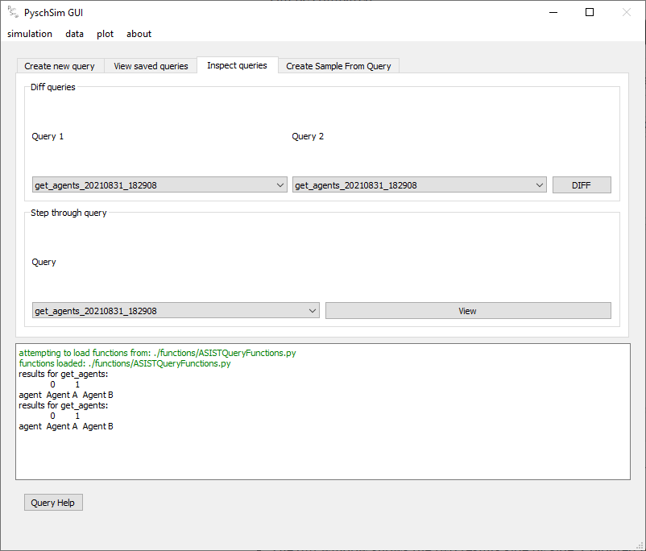
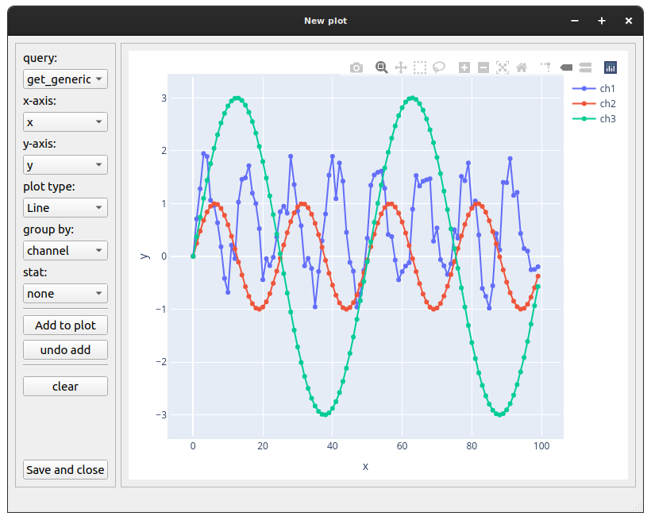

GUI Functionalty
****************

Simulation
==========

view simulation info (start screen)
-----------------------------------

-   The ‘run sim’ screen lets you set the paths for psychsim, and the simulation file, load the sim,
    run the sim (and stop it), and rename the output data.

.. image:: ../tutorial/images/gui_startup.png

1. **Select PsychSim Dir**: Set the path to the psychsim root directory
2. **Select Model Dir**: Set the path to the psychsim definitions root directory
3. **Select Simulation file**: set the path to the simulation script
4. **Load Simulation**: load the simulation file (import it) into the GUI. *NOTE* a simulation MUST be loaded after selected. This button allows changes to simulation code to be quickly implemented, then ‘re-loaded’ in the sim without having to re-find the path.
5. **RUN SIM**: becomes active when a valid simulation is loaded. Start the simulation thread
6. **STOP SIM**: Stop the simulation thread and save the data
7. **RENAME**: Rename the run to a desired name

data
====
view table of stored data
-------------------------

- View loaded raw shows you info about data loaded in the GUI. These could come from simulation runs, or from loading saved data sets.
- Data is saved and loaded from Pickle file

.. image:: images/view_data.png

- **RENAME**: rename the data ID for use through the GUI.
- **Save**: Save the data to disk (as a pickle file). Data is saved to the ‘sim_output’ directory
- **Load data from file**: Load saved (pickle) data

Query
=====
create query from data/sample
-----------------------------
-   Data can be saved as any arbitrary python object. The query screen allows custom functions to be run
    to extract desired information from simulation outputs. Different queries results can also be compared
    (Diff), or sampled.
-   New functions can be written to handle different queries, and different simulation output types
    (see: ::ref:`function_definitions`.)
-   Queries are saved for viewing, diffing, sampling, and plotting.

Create new query
^^^^^^^^^^^^^^^^
- Create and save a new query

.. image:: images/query_create.png

- **Select function to query data**: select the custom function to run on the data. E.g. get_beliefs will extract beliefs for agents after a psychsim simulation run. Get_actions: extracts only actions, etc.
- **Agent, action, cycle, horizon, state**: these are parameters to pass to the selected function *NOTE* only ‘agent’ is currently implemented.
- **Show function doc**: display the docstring of the function
- **Execute function**: execute the function. This pops up the results dialog
- **Results Dialog**: allows you to rename the query

View saved queries
^^^^^^^^^^^^^^^^^^
- View saved queries, and save as a CSV to disk

.. image:: images/query_view.png

- **Select Query**: Shows saved query info *NOTE* These are saved internally, not saved to disk
- **View Query Data**: Shows saved queries data
- **Save as CSV**: Save the query as a CSV file to disk
- **Delete selected query**: delete the currently selected query. A dialog will appear asking if you really want to.

Compare saved query results
^^^^^^^^^^^^^^^^^^^^^^^^^^^
-   Diff two queries created by the same function. Only queries with the same columns can be compared.

-   **Query 1**: First query to compare
-   **Query 2**: Second query to compare
-   **DIFF**: Execute the comparison

-   The diff window shows the two results side by side. Coloured text indicates a difference between the two
    queries. Black text indicates the row is the same.

.. image:: ../tutorial/images/generic_diff_table.png

Create Sample from Query
^^^^^^^^^^^^^^^^^^^^^^^^
-   Queries can be sampled by selecting values from variables within the query result. They can be sampled using
    a range or a category function. Range function only works for numerical values, where as categorical can
    be applied to any value.

    The sampling works by selecting a range or category from a specific variable, and then selecting all rows
    that meet that criteria across the entire query result data.

.. image:: images/query_sample.png

-   **Select query**: The query to create a sample from
-   **Sample variable**: Variable within the query results to create the sample from
-   **Sample function**: Either 'range' or 'category'
-   **Select Sample**: Select the values to create the sample with (this will open a dialog)

.. image:: ../tutorial/images/generic_range_select.png

-   The range dialog lets you select a range of values (within the maximum range of the selected variable)

.. image:: ../tutorial/images/generic_category_select.png

-   The category dialog lets you select individual values from the selected variable. Multiple values can be
    selected.

plot
====
plot query results
------------------
- Allows you to plot queries as plotly plots.
- Only queries can be plotted, not raw data.
- creating a new plot opens a new plot window
- multiple plot windows can be open at once

.. image:: images/plot.png

- **Test datasets enabled**: for testing, allows you to use built-in datasets to test plotting functionality
- **Create new plot**: opens a new plot window
- **Remove selected from list**: Remove a saved plot from the list

- **query**: select the query to plot
- **X-axis**: select the variable to put on the x-axis
- **Y-axis**: select the variable to put on the y-axis
- **Group**: select the variable to group traces by. e.g. if you want to view the actions of multiple agents over time. You might want to group by agents. Do differentiate the traces.
- **Plot type**: select the type of plot to display. *NOTE* not all plot types are suitable for all plots. It is up to the user to know which plot is useful for the given variables.
- **Stat**: select the stat to apply. This is applied over the ‘group’ variable
- **Add to plot:** add the trace with given parameters to the current plot
- **Undo add:** undo the previously added plot
- **Clear:** clear the plot and start from scratch
- **Save and close**: Save the current plot. Saved plots appear in the list below this button. Saved plots can be viewed by clicking on the name in the list.

