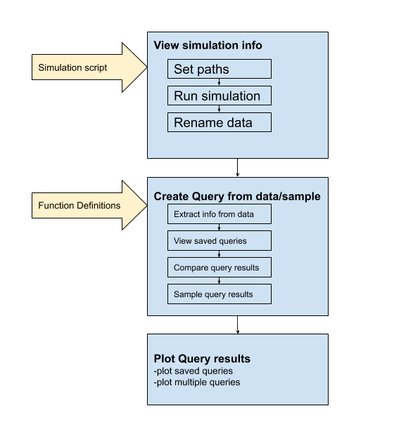

Introduction
************

The workflow of the GUI is described in the flowchart below. First, a simulation is loaded and run.
This will generate some 'run data'. The raw data can be queried using query functions. The results of these
query functions can be compared to show differences. They can also be sampled to create a new query.
The results of these query functions can also be plotted.

PsychSim Gui can be used to run custom simulation scripts. These scripts can be generic but must follow a
few rules (see: :ref:`function_definitions`). Once the simulation is run, the results are stored internally in the GUI
and can be saved to disk as a pickle file.
